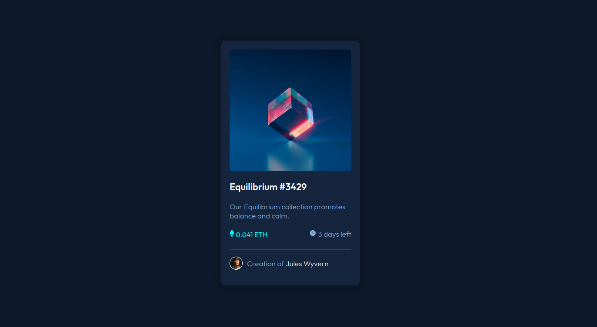
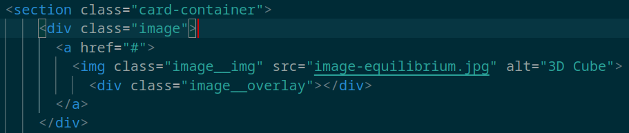
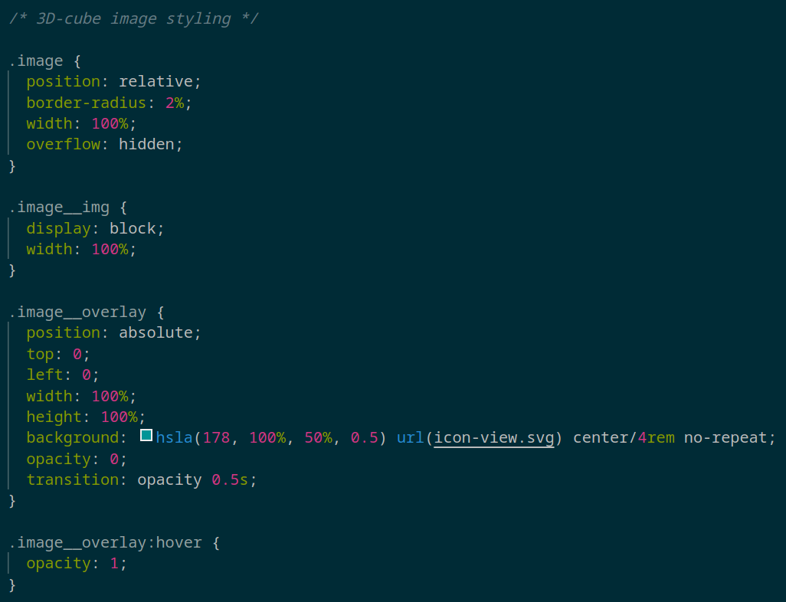

# Frontend Mentor - NFT preview card component solution

This is a solution to the [NFT preview card component challenge on Frontend Mentor](https://www.frontendmentor.io/challenges/nft-preview-card-component-SbdUL_w0U). Frontend Mentor challenges help you improve your coding skills by building realistic projects. 

## Table of contents

- [Overview](#overview)
  - [Screenshot](#screenshot)
  - [Links](#links)
- [My process](#my-process)
  - [Built with](#built-with)
  - [What I learned](#what-i-learned)
  - [Useful resources](#useful-resources)
- [Author](#author)

## Overview

### Screenshot

### Links

- Solution URL: [Please view my solution.](https://mreyna12.github.io/NFTCard/)

## My process

### Built with

- HTML5
- CSS3

### What I learned

The difficult part of this challenge was placing an overlay on the image of the 3d-cube. I couldn't quite figure out where I needed to place my classes or where I needed to place the `div` for the overlay. After watching the video mentioned in [useful resources](#useful-resources), I composed the following HTML:

Now that I had my HTML in place, I was able to compose corresponding CSS:

### Useful resources

- [Overlay:hover](https://www.youtube.com/watch?v=exb2ab72Xhs) - This video by dcode helped me create an overlay and position it over the image of the 3d-cube. I really liked this video as they explain the reasoning behind their decision-making, which made it easier for me to understand how to apply the concepts to my HTML and CSS.

## Author

- Frontend Mentor - [@MReyna12](https://www.frontendmentor.io/profile/MReyna12)
- Twitter - [@Fraktionn](https://twitter.com/Fraktionn)
- LinkedIn - [@michaelpreyna](https://www.linkedin.com/in/michaelpreyna/)